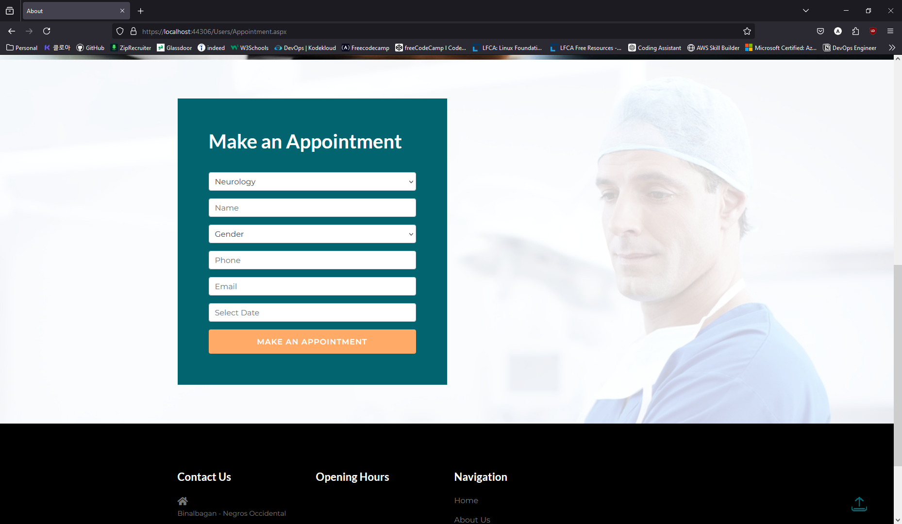
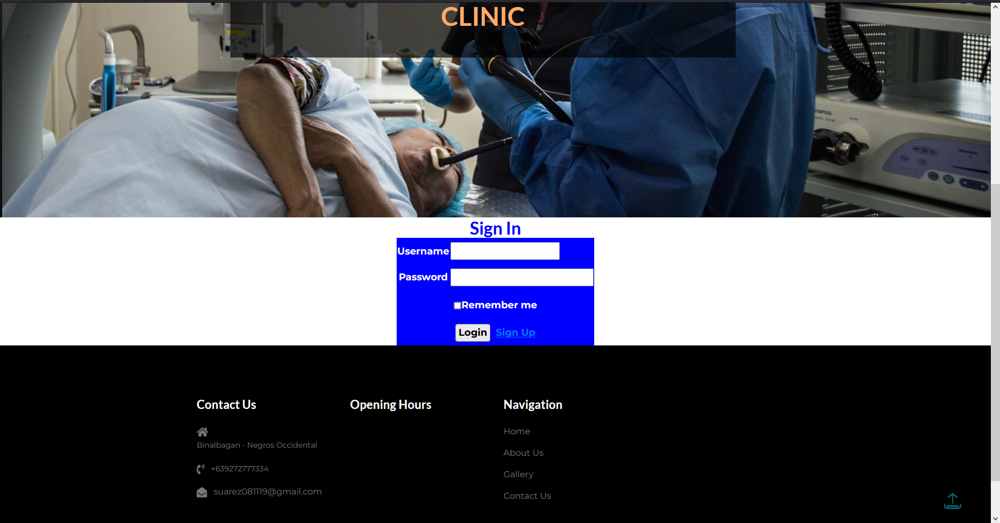

# Hospital Management System Project In ASP.NET

## Abstract
The Hospital Management System in ASP.NET is a comprehensive web-based application designed to facilitate the efficient management of healthcare information and the streamlined completion of tasks by healthcare providers. This system enables the administration and operation of hospital activities, including patient management, appointment scheduling, and medical records management.

## Project Type
- **Website**

## Technology Stack
- **Frontend**: ASP.NET (C#)
- **Development Environment**: Visual Studio 2022
- **Backend**: SQL Server 2021

## Development Period
- **Start Date**: 2024-06-24
- **End Date**: 2024-09-01

## Database
- **SQL Server 2021**

## Screenshot
### Homepage

### Appointment Page

### Sign and Register Screenshot

